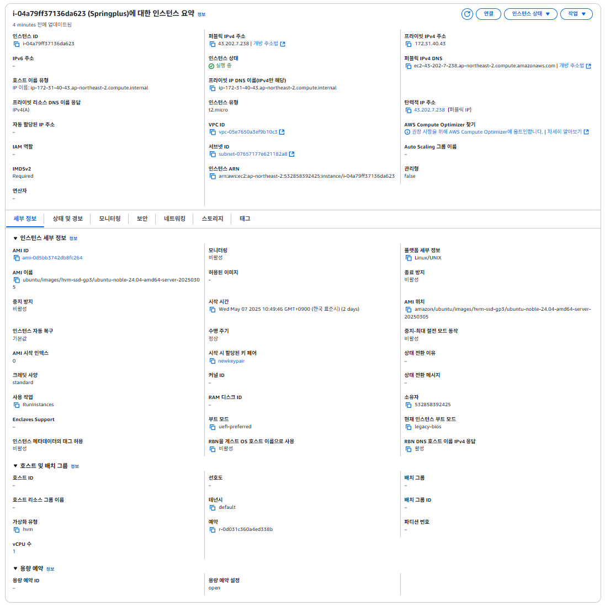

# SPRING PLUS

---

## AWS

### Health Check
- URL: http://43.202.7.238:8080/health
- Response: "OK"

### EC2


#### 탄력적 IP


---

### RDS


---

### S3


---

### 어플리케이션 동작

`.jar` 빌드 후 **Git Bash**를 통해 EC2에 업로드
```bash
scp -i /e/newkeypair.pem /e/Spring/spring-plus/build/libs/expert-0.0.1-SNAPSHOT.jar ubuntu@43.202.7.238:/home/ubuntu/
```

---

## 대용량 데이터 처리 개선

쿼리의 경우 기본 쿼리문을 사용하기에 추가적인 개선이 어렵다고 판단, DB 성능 개선을 중점으로 과제 진행

성능 테스트의 경우 1000명의 사용자가 10초간 데이터를 요청하는것으로 진행함.

1차: nickname이 인덱싱 되어 있지 않아 Full Scan을 진행 -> 인덱싱 함으로 조회 속도 상승

2차: 대량의 동시 요청이 들어올 때 데이터베이스 연결에 병목이 생길 수 있음 -> 커넥션 튜닝을 진행하여 처리 성능 상승

3차: 반복되는 동일 조회 요청을 더 빠르게 진행 할 수 있는 방법을 찾던 중 Redis 도입 -> 캐시를 사용해 DB 부화 최소화, 메모리 기반이므로 DB 보다 처리 속도 빠름

### 최초 코드 성능


### 1차 개선 - DB 인덱싱


### 2차 개선 - DB 커넥션 풀 튜닝


### 3차 개선 - Redis 캐싱


---

### 최종 요약
#### 1. 응답 시간


---

#### 2. 실패률


---

#### 3. 동시간 요청 수


---
